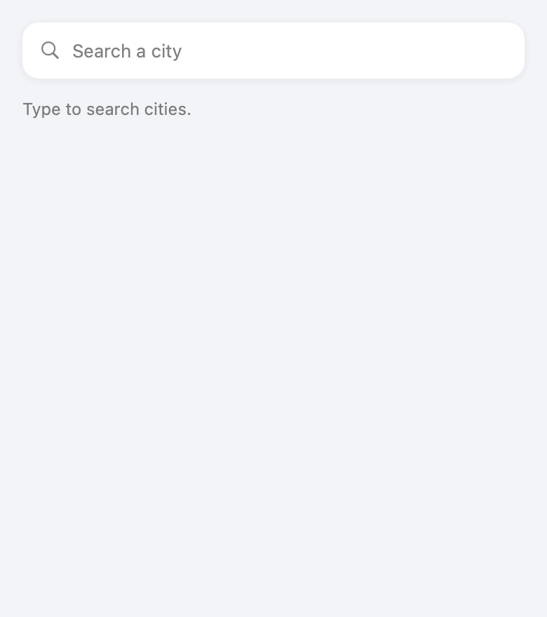

# Pulse


**A config-driven, white-label dashboard — fork it, edit one JSON file, ship your own app.** One `Brand.json` controls the name, the accent color, and which data modules render, in what order. The architecture is protocol-oriented, so swapping a data source (weather, earthquakes, or your company's commercial API) is one new file and **zero UI changes**. Offline-first by design: the last good response is cached and served with its staleness, so the screen stays useful without a connection.

|  |  |
| --- | --- |
| **Platforms** | iOS — SwiftUI + Observation · Android — Kotlin core (same `Brand.json`) |
| **Servers** | Vapor brand service (Swift) · aggregating BFF (TypeScript / Node) |
| **Architecture** | MVVM-Coordinator · protocol-oriented · offline-first |
| **Tested** | 58 tests across 4 stacks — keyless, no network in any test |
| **CI** | 4 jobs (iOS · server · BFF · Android), green on every push |

> ⚙️ **Workflow transparency:** built with an AI-assisted workflow (Claude as pair programmer — see the commit trailers). The architecture decisions, the code review, and the final call on every line are mine.

## See it move

A start-to-finish walkthrough — a live dashboard, two rebrands, the earthquakes detail, and a debounced city search — every frame rendered from the **real SwiftUI views** (`swift run pulse-screenshots`), no simulator, no mockups:


---

## User scenarios, start to finish

Every screenshot below is rendered from the production views with fixed sample data — what you see is what the app draws.

### 1 · Launch → a live dashboard


Each module fetches, caches, and shows its **freshness**. Here the weather card is fresh ("Updated 4m ago") while the earthquakes card is serving cached data — note the honest offline chip, *"Offline — showing data from 12m ago."* Staleness is surfaced, never hidden.

### 2 · Rebrand by editing one file


Same binary, different `Brand.json`. Acme reorders modules and paints itself orange; Marina drops earthquakes entirely and goes teal. Name, accent, and module set/order are **all** config — no code touched.

```json
{ "appName": "Acme Field Ops", "accentColorHex": "#E05910", "modules": ["earthquakes", "weather"] }
```

### 3 · A fetch fails → a readable, retryable message


A dead network **degrades, it doesn't crash**. Each module renders one of three phases — loading, loaded, or a plain-language, retryable failure. A broken `Brand.json` is treated the same way: it downgrades to defaults, never a crash.

### 4 · Search a city → its weather



Type a city; keystrokes are **debounced with Combine** (`CitySearchModel`) against Open-Meteo's keyless geocoder. Pick a result and it reuses the **same** `WeatherCard` the dashboard renders — search and dashboard can't drift apart. This is the state-vs-stream boundary drawn in code: view-model state stays on Observation, the keystroke *stream* uses Combine's `debounce`.

### 5 · Drill into a card → the full list


Tapping a card navigates. A typed `Router` owns the path and `DashboardView` resolves every route to a screen **in one place** — the cards say *"go here,"* never *"how."* The earthquakes card opens the full list; the weather card opens city search.

---

## How it's built

### Architecture — MVVM-Coordinator

```
Brand.json ──► BrandConfig ─────────────┐  (name, accent, module order)
                                        ▼
 DataProvider (protocol) ──► ModuleModel (@Observable) ──► DashboardView
   ├── OpenMeteoProvider        │ loading / loaded / failed     │ renders whatever
   └── USGSQuakesProvider       ▼                               ▼ descriptors it gets
                          PayloadCache (actor) ──► ProviderResult(fetchedAt, isStale)
                          offline-first, corruption-as-miss     └► StalenessChip (honesty in the UI)
```

The folders map straight onto MVVM-Coordinator, and the repo is one polyglot monorepo:

```
Sources/            iOS app — MVVM-Coordinator
  PulseCore/        Model — config, provider contract, cache (UI-free package)
  PulseProviders/   Model — concrete keyless-API providers
  PulseUI/
    ViewModels/     ModuleModel, CitySearchModel
    Views/          DashboardView, Cards/, detail screens
    Navigation/     Coordinator — Route + Router
    Composition/    composition root — wires providers → view models → UI
    Support/        color + sample data
server/             brand service (Swift / Vapor)
bff/                aggregating BFF (TypeScript / Express)
android/            core ported to Kotlin — same Brand.json
```

The **Model** lives in its own packages, so MVVM-Coordinator is enforced by **dependency direction** — `PulseUI` may import the model, never the reverse — not just by folder names.

### Two platforms, one Brand.json

The architecture isn't iOS-specific. [`android/`](android) is a Kotlin port of the core — the same `Brand.json`, the same offline-first provider contract — proving the design ports cleanly instead of just claiming it does:

| iOS (Swift) | Android (Kotlin) |
| --- | --- |
| `@Observable` view model | `StateFlow` |
| `actor` cache | `Mutex`-guarded cache |
| `URLSession` + injected session | `HttpFetcher` fun interface |
| `DataProvider` protocol | `DataProvider<T>` interface |

The `core` module is pure Kotlin/JVM, so it builds and tests with just a JDK — no Android SDK: `cd android && ./gradlew :core:test`. The Jetpack Compose UI is the next layer on top.

### Two servers, two jobs

White-labeling, one step past a bundled file — and each server does exactly one thing.

**[`server/`](server) — the brand service (Vapor / Swift).** *"What is this brand?"* It path-depends on this package and returns the **exact same `BrandConfig`** the app decodes, so the wire contract can't drift from the client. On the app side, `RemoteBrandProvider` falls back to a bundled default on any failure, so the app still launches offline.

```
GET /brands/:id   → that brand's BrandConfig as JSON (404 if unknown)
```

**[`bff/`](bff) — the aggregating BFF (Express / TypeScript).** *"What goes on this brand's screen?"* It reads the brand, then fetches **only** the modules that brand asks for — in parallel, in order — and returns one payload, so the app fills its whole dashboard in a **single round-trip** instead of fanning out itself. `FeedProvider` decodes it straight into the existing domain types.

```
GET /feed/:brandId → { brand, modules: [ { id, weather?, quakes? } ] }
```

Swift owns the domain (and shares its model with the app); TypeScript owns the aggregation, where the JS BFF ecosystem is at home. **Polyglot by role, not by résumé.**

---

## Why you can trust it

- **58 tests, four stacks, zero network.** Every test injects its seam — a stubbed `URLSession`, a fake gateway — so the suite is deterministic and offline. Providers are covered for parsing, degradation, and typed failures; the cache and view-models for their state transitions.
- **CI proves it on every push.** Four independent jobs — iOS (macOS), Vapor (macOS), BFF (Ubuntu/Node), Android (Ubuntu/JDK) — all green. `npm audit` is clean; only Express ships.
- **Keyless & reproducible.** Every data source is a free, no-key public API, so any reviewer can `clone → build → test` with zero setup. Reproducibility is a feature.
- **Honest by construction.** Screenshots and the demo GIF are rendered from the real views, not drawn in a design tool. Staleness is shown, not hidden.

### Decisions

| Decision | Why |
| --- | --- |
| **Observation for state, Combine for streams** | View-model state uses Observation — no `AnyCancellable` bookkeeping, compile-time observed properties, the direction Apple is investing in for iOS 17+. The one genuine *stream*, debounced city search, uses Combine's `debounce` — exactly what it's built for. Match the tool to state-vs-stream; don't force one framework everywhere. |
| **A router, added when navigation appeared** | One screen needed no coordinator — routing nothing is ceremony. Detail screens introduced real navigation, so a typed `Router` owns the path and `DashboardView` maps routes to screens in one place. Introduce the pattern when the need shows up, not before. |
| **The server shares the app's domain model** | The brand service path-depends on `PulseCore` and returns the same `BrandConfig` the client decodes. One type, not a hand-kept-in-sync pair, so the HTTP contract can't silently drift from the app. |
| **Two servers, each with one job** | Swift owns the domain; TypeScript owns aggregation — the client-tailored feed — where the JS BFF ecosystem fits. Polyglot by role, not by résumé. |
| **The core ports to Kotlin without a rewrite** | It's plain data, a provider contract, and a cache — no iOS-only concepts — so the Android core is a direct mirror (`StateFlow` for Observation, `Mutex` for the actor) reading the very same `Brand.json`. |
| **Actor cache over locks/queues** | Data-race safety by construction; the compiler enforces what a `DispatchQueue` convention only suggests. |
| **Cache exposes age, not a TTL** | "Too stale" is a product decision that differs per module and per customer; storage shouldn't decide it. |
| **Config-over-code white-labeling** | A fork-and-ship customer edits data, not Swift. Per-field decode defaults mean a broken brand file downgrades instead of crashing. |
| **Keyless public APIs** | Any reviewer can clone → build → test with zero setup. Reproducibility is a feature. |
| **SPM package, no .xcodeproj** | `swift build && swift test` works headlessly — locally and in CI — and Xcode opens the package directly. |

---

## Run it

```bash
# iOS core + UI (SwiftUI package)
swift test                                   # 35 tests
swift run pulse-screenshots docs/screenshots # re-render every image + the GIF

# Android core (pure Kotlin/JVM — no Android SDK)
cd android && ./gradlew :core:test           # 13 tests

# Brand service (Vapor)
cd server && swift run pulse-server           # :8080

# Aggregating BFF (Node)
cd bff && npm install && npm test && npm start # :8081
```

**Fork & rebrand:** fork the repo, edit `Brand.json` (name, accent, modules), ship. To add a data source, implement `DataProvider` (one file), register it in the catalog, and put its id in `Brand.json` — `DashboardView` never changes.

## Status & what's next

Everything above is built, tested, and green in CI. The honest edges:

- **Android Compose UI** — the Kotlin `core` is done and tested; the Compose screens are the next layer (they need the Android SDK the render pipeline here doesn't have).
- **Live end-to-end** — the client providers and both servers are covered behind injected seams; wiring the app to the live BFF is a small next step.

## Data source licensing

- **Open-Meteo** is free for **non-commercial** use ([terms](https://open-meteo.com/en/terms)). A company shipping Pulse commercially swaps in its licensed weather provider — implement `DataProvider`, register it, done.
- **USGS** earthquake feeds are U.S. government **public domain**.
