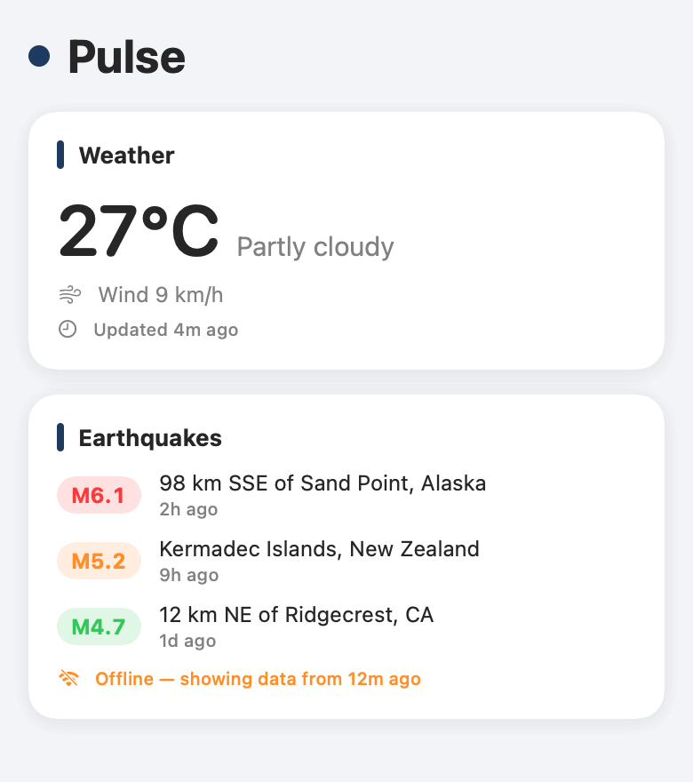
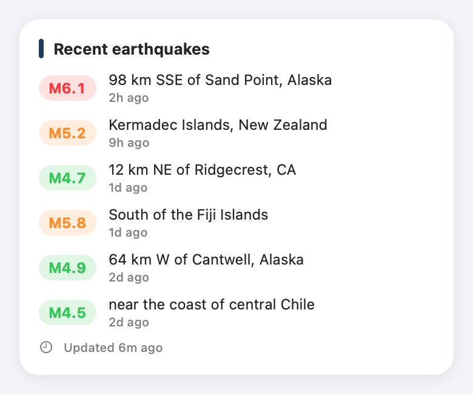
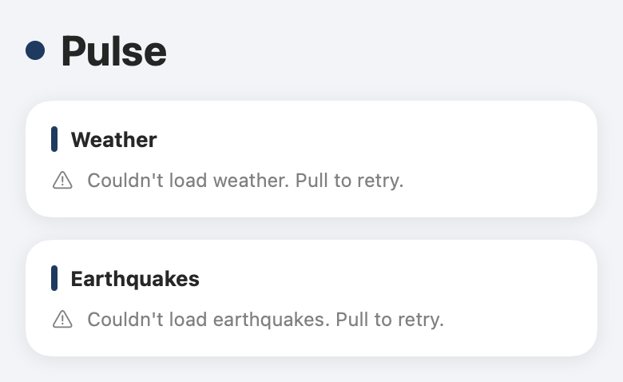

# Pulse


**Pulse is a config-driven, white-label dashboard for iOS built over free, keyless public APIs — fork it, edit `Brand.json`, ship your own.** One JSON file controls the app's name, accent color, and which data modules render; the architecture is protocol-oriented so adding or swapping a data provider (weather, earthquakes, or your company's commercial API) requires zero UI changes. Offline-first by design: the last successful response is cached and served with its staleness, so the dashboard stays useful without a connection.

> ⚙️ **Workflow transparency:** built with an AI-assisted workflow (Claude as pair programmer — see the commit trailers); the architecture decisions, code review, and final call on every line are mine.

## Demo

A start-to-finish walkthrough — loaded dashboard → two rebrands → the earthquakes detail → city search → a picked city's weather. Every frame is rendered from the real SwiftUI views (`swift run pulse-screenshots`), no simulator:



## One codebase, three brands

| Pulse (default) | Acme Field Ops | Marina Weather |
| --- | --- | --- |
|  |  |  |

Every column is the same code with a different `Brand.json` — name, accent color, and module set/order all come from config. Images are rendered from the real SwiftUI views with fixed sample data (`swift run pulse-screenshots`); the earthquakes card is deliberately shown stale so the offline chip is visible.

## City search

Type a city, get its weather. The search field debounces keystrokes with **Combine** (`CitySearchModel`), queries Open-Meteo's keyless geocoder, and a pick reuses the **same** `WeatherCard` and `ModuleModel` the dashboard renders — so search and dashboard can't drift apart.

| Debounced search | Picked city |
| --- | --- |
|  |  |

This is where the Observation/Combine boundary shows up in code: view-model **state** stays on Observation, while the **stream** of keystrokes uses Combine's `debounce` — see [Decisions](#decisions). Both screens render from the real `CitySearchContentView` with fixed sample data, same pipeline as the brand gallery.

## Navigation

Tap a dashboard card to drill in: weather opens city search, earthquakes opens the full list. A typed `Router` owns the navigation path and `DashboardView` resolves every route to a screen in one place — the cards say "go here," never "how."



The first cut deliberately had *no* coordinator — with one screen there was nothing to route. The `Router` arrived with the detail screens, when navigation became real; see [Decisions](#decisions).

## Every state, handled

Each module renders one of three phases — loading, loaded, or a readable, retryable failure — so a dead network degrades instead of crashing. Cached data is served with its age (the offline chip in the gallery above); a failed fetch says so plainly:



## Fork & rebrand in 3 steps

1. **Fork** this repo.
2. **Edit `Brand.json`** — name, accent color, and which modules render, in what order:
   ```json
   { "appName": "Acme Field Ops", "accentColorHex": "#E05910", "modules": ["earthquakes", "weather"] }
   ```
3. **Ship.** No code changes. To swap in your commercial data source, implement `DataProvider`
   (one file), add one entry to the module catalog, and put its id in `Brand.json` — `DashboardView`
   never changes. That swap path is the whole point of the architecture.

## Brand service — config over the wire

The same white-labeling, one step further: instead of bundling `Brand.json`, a fork can serve brands from an API. [`server/`](server) is a small [Vapor](https://vapor.codes) service that path-depends on this package and returns the **exact same `BrandConfig`** the app decodes — one domain model, not two, so the wire contract can't drift from the client.

```
GET /health       → 200 "ok"
GET /brands/:id   → that brand's BrandConfig as JSON (404 if unknown)
```

```bash
cd server && swift run pulse-server     # serves on http://127.0.0.1:8080
curl localhost:8080/brands/acme
```

On the client, `RemoteBrandProvider` fetches a brand and **falls back to a bundled default** on any failure — bad response, decode error, or no network — so the app still launches offline, the same stance as the data providers. The server is its own SPM package, so the iOS package keeps building with zero third-party dependencies.

## Aggregating BFF — one tailored round-trip

The brand service answers *"what is this brand?"*; a separate **backend-for-frontend** answers *"what goes on this brand's screen?"*. [`bff/`](bff) is a TypeScript/Express service that reads the brand from the Vapor service, then fetches **only** the modules that brand asks for — in parallel, in the brand's order — and returns one payload:

```
GET /feed/:brandId → { brand, modules: [ { id, weather?, quakes? } ] }
```

So the app fills its whole dashboard in a single request instead of fanning out to each API itself. On the client, `FeedProvider` decodes that straight into the existing `BrandConfig`, `WeatherSnapshot`, and `Quake` types.

```bash
cd bff && npm install && npm start     # http://127.0.0.1:8081 (expects the brand service on :8080)
curl localhost:8081/feed/acme
```

Upstreams sit behind an injected gateway, so the whole thing tests with no network (`npm test`).

## Architecture

```
Brand.json ──► BrandConfig ─────────────┐  (name, accent, module order)
                                        ▼
 DataProvider (protocol) ──► ModuleModel (@Observable) ──► DashboardView
   ├── OpenMeteoProvider        │ loading / loaded / failed     │ renders whatever
   └── USGSQuakesProvider       ▼                               ▼ descriptors it gets
                          PayloadCache (actor) ──► ProviderResult(fetchedAt, isStale)
                          offline-first, corruption-as-miss     └► StalenessChip (honesty in the UI)
```

- **PulseCore** — config, provider contract, caching. UI-free, unit-testable anywhere.
- **PulseProviders** — concrete keyless-API providers; each normalizes its wire shape at one boundary.
- **PulseUI** — SwiftUI + Observation; a pure function of config and payloads.

## Decisions

| Decision | Why |
| --- | --- |
| **Observation for state, Combine for streams** | View-model state uses Observation — no `AnyCancellable` bookkeeping, compile-time observed properties, the direction Apple is investing in for iOS 17+. The one genuine *stream*, debounced city search, uses Combine's `debounce` — exactly what it's built for (`CitySearchModel`). Matching the tool to state-vs-stream beats forcing one framework everywhere. |
| **A router, added when navigation appeared** | One screen needed no coordinator — routing nothing is ceremony. Detail screens introduced real navigation, so a typed `Router` owns the path and `DashboardView` maps routes to screens in one place. Introduce the pattern when the need shows up, not before. |
| **The server shares the app's domain model** | The brand service path-depends on `PulseCore` and returns the same `BrandConfig` the client decodes. One type, not a hand-kept-in-sync pair, so the HTTP contract can't silently drift from the app. |
| **Two servers, each with one job** | Swift (Vapor) owns the domain and shares `BrandConfig` with the app; TypeScript (Node) owns aggregation — the client-tailored feed — where the JS BFF ecosystem is at home. Polyglot by role, not by résumé. |
| **Actor cache over locks/queues** | Data-race safety by construction; the compiler enforces what a `DispatchQueue` convention only suggests. |
| **Cache exposes age, not a TTL** | "Too stale" is a product decision that differs per module and per customer; storage shouldn't decide it. |
| **Config-over-code white-labeling** | A fork-and-ship customer edits data, not Swift. Per-field decode defaults mean a broken brand file downgrades instead of crashing. |
| **Keyless public APIs** | Any reviewer can clone → build → test with zero setup. Reproducibility is a feature. |
| **SPM package, no .xcodeproj** | `swift build && swift test` works headlessly — locally and in CI — and Xcode opens the package directly. |

## Data source licensing

- **Open-Meteo** is free for **non-commercial** use ([terms](https://open-meteo.com/en/terms)). A company shipping Pulse commercially swaps in its licensed weather provider — implement `DataProvider`, register it in the catalog, done (see *Fork & rebrand*).
- **USGS** earthquake feeds are U.S. government **public domain**.

## Roadmap

- [x] docs: add README with project vision and roadmap
- [x] chore: add Swift/Xcode .gitignore
- [x] chore: add MIT license
- [x] feat: scaffold modular package targets — Core / Providers / UI (iOS 17+)
- [x] feat: add BrandConfig loader (Brand.json → name, accent, modules)
- [x] feat: add DataProvider protocol with async fetch + cache hooks
- [x] feat: add Open-Meteo weather provider (keyless) with unit tests
- [x] feat: add USGS earthquake provider (keyless) with unit tests
- [x] feat: render dashboard modules driven by config
- [x] ci: add GitHub Actions workflow (build + test, macOS runner)
- [x] docs: add multi-brand screenshots rendered from the real views
- [x] docs: add architecture notes + rebrand-in-3-steps + decisions log
