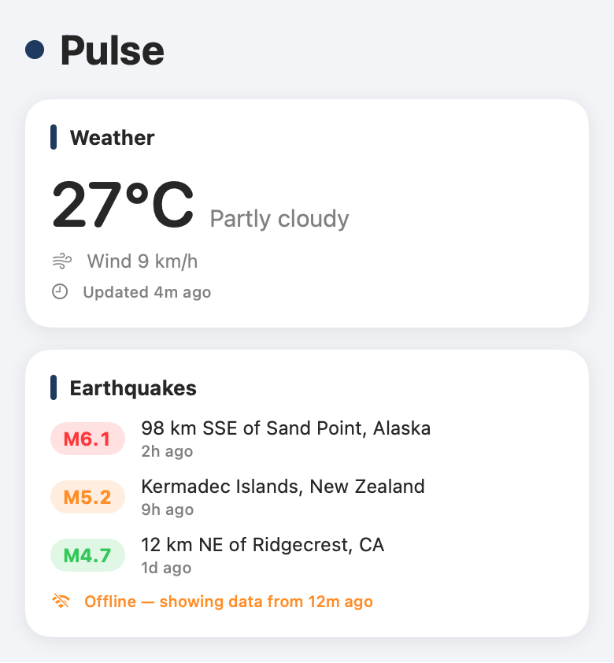
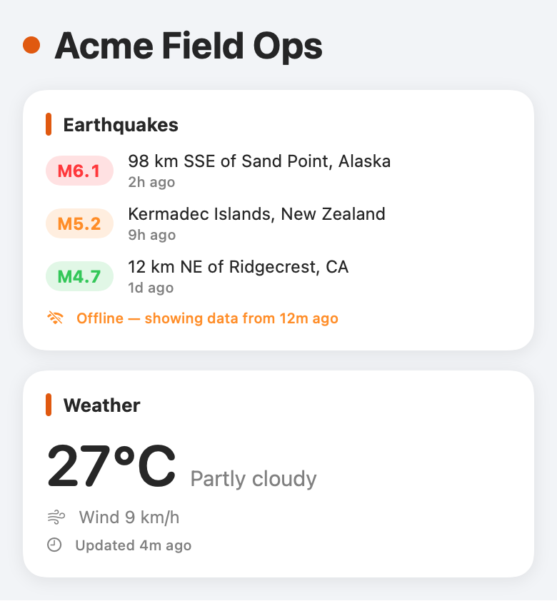
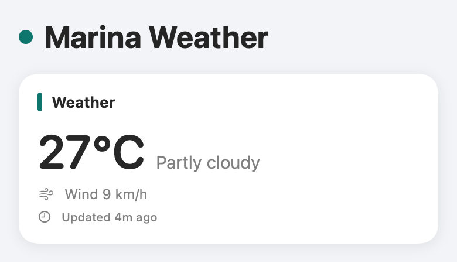

# Pulse

**Pulse is a config-driven, white-label dashboard for iOS built over free, keyless public APIs — fork it, edit `Brand.json`, ship your own.** One JSON file controls the app's name, accent color, and which data modules render; the architecture is protocol-oriented so adding or swapping a data provider (weather, earthquakes, or your company's commercial API) requires zero UI changes. Offline-first by design: the last successful response is cached and served with its staleness, so the dashboard stays useful without a connection.

> ⚙️ **Workflow transparency:** built with an AI-assisted workflow (Claude as pair programmer — see the commit trailers); the architecture decisions, code review, and final call on every line are mine.

## One codebase, three brands

| Pulse (default) | Acme Field Ops | Marina Weather |
| --- | --- | --- |
|  |  |  |

Every column is the same code with a different `Brand.json` — name, accent color, and module set/order all come from config. Images are rendered from the real SwiftUI views with fixed sample data (`swift run pulse-screenshots`); the earthquakes card is deliberately shown stale so the offline chip is visible.

## Roadmap

- [x] docs: add README with project vision and roadmap
- [x] chore: add Swift/Xcode .gitignore
- [x] chore: add MIT license
- [x] feat: scaffold modular package targets — Core / Providers / UI (iOS 17+)
- [x] feat: add BrandConfig loader (Brand.json → name, accent, modules)
- [x] feat: add DataProvider protocol with async fetch + cache hooks
- [x] feat: add Open-Meteo weather provider (keyless) with unit tests
- [x] feat: add USGS earthquake provider (keyless) with unit tests
- [x] feat: render dashboard modules driven by config
- [ ] ci: add GitHub Actions workflow (build + test, macOS runner)
- [x] docs: add multi-brand screenshots rendered from the real views
- [ ] docs: add architecture notes + rebrand-in-3-steps
